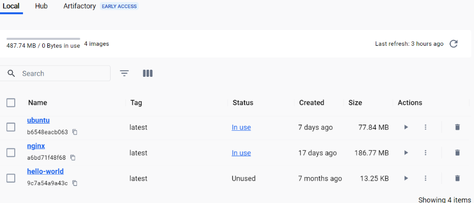
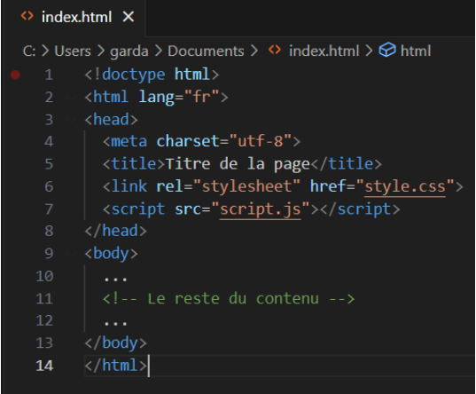
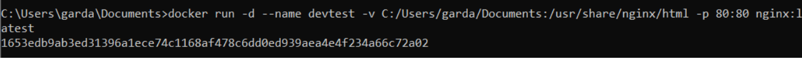
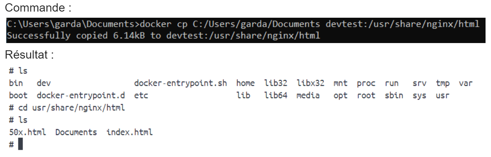

# tpDockerDevOps

## 1 - Installer Docker et Docker-Compose
J'ai installé Docker Desktop qui comprend le DOcker-Compose
## 2 - Quelques commandes à tester
Toutes les commandes ont fonctionnés
## 3 - Ressources supplémentaires pour découvrir Docker
J'ai pu faire la Partie 2 : Containerize an application
Après avoir lancé toutes les commandes on a build une application depuis un zip vers un conteneur grâce à un Dockerfile.
## 4 - DÉBUT DU TP
## 5 - Exécuter un serveur web (apache, nginx, …) dans un conteneur docker
### A - Récupérer l’image sur le Docker Hub
J'ai récupéré l'image sur ce site : [Docker](https://hub.docker.com/_/nginx)

Où j'ai pu trouver la commande : `docker pull nginx`

Qui permet d'importer une image.

### B - Vérifier que cette image est présente en local


Il est aussi possible de vérifier en ligne de commande grâce à : `docker ps`
### C - Créer un fichier index.html simple

### D - Démarrer un conteneur et servir la page html créée précédemment à l’aide d’un volume (option -v de docker run)

### E - Supprimer le conteneur précédent et arriver au même résultat que précédemment à l’aide de la commande docker cp


## 6 - Builder une image
### A - A l’aide d’un Dockerfile, créer une image (commande docker build)
```console
#image
FROM nginx

#index.html
COPY html/ usr/share/nginx/html/%
```